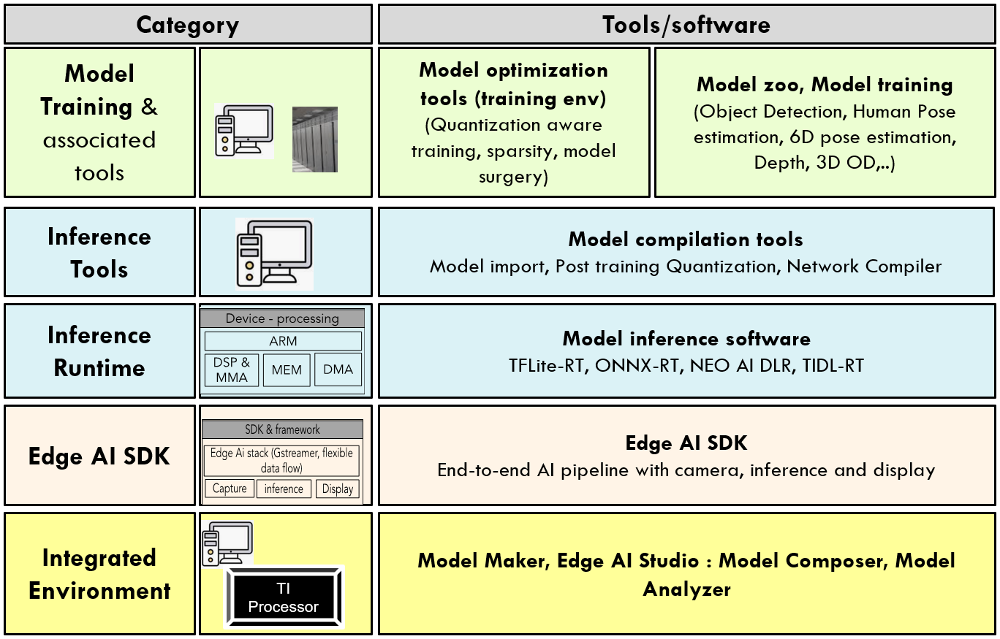
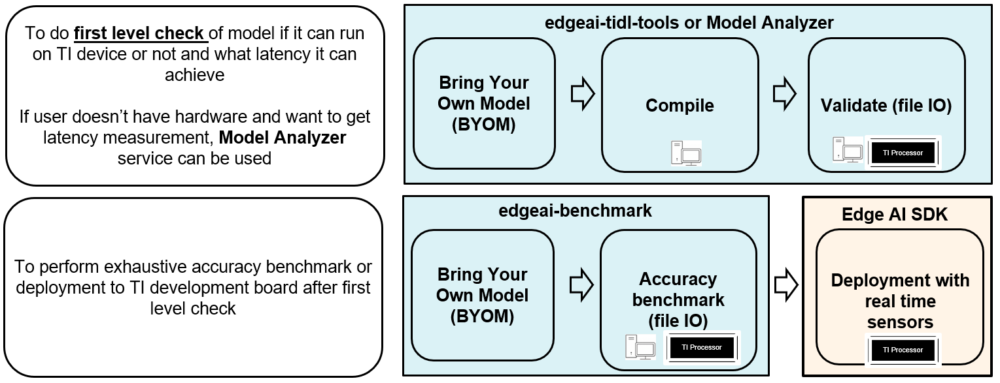
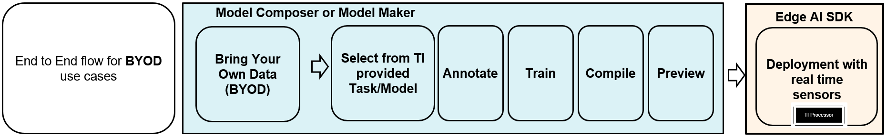

# Edge AI Software And Development Tools

## Notice
Our documentation landing pages are the following:
- https://www.ti.com/edgeai : Technology page summarizing TI’s edge AI software/hardware products 
- https://github.com/TexasInstruments/edgeai : Landing page for developers to understand overall software and tools offering  

## Introduction

Embedded inference of Deep Learning models is quite challenging - due to high compute requirements. TI’s Edge AI comprehensive software product help to optimize and accelerate inference on TI’s embedded devices. It supports heterogeneous execution of DNNs across cortex-A based MPUs, TI’s latest generation C7x DSP and DNN accelerator (MMA). 

TI's Edge AI solution simplifies the whole product life cycle of DNN development and deployment by providing a rich set of tools and optimized libraries. 

## Overview

The figure below provides a high level summary of the relevant tools: 

## Details of various tools

The table below provides detailed explanation of each of the tools:

| Category                                                                | Tool/Link                                                                  | Purpose  | IS NOT                |
|-------------------------------------------------------------------------|---|--|-----------------------|
| **Inference (and compilation) Tools**                                   | [edgeai-tidl-tools](https://github.com/TexasInstruments/edgeai-tidl-tools) | To get familiar with model compilation and inference flow - [Post training quantization](https://github.com/TexasInstruments/edgeai-tidl-tools/blob/master/docs/tidl_fsg_quantization.md) - Benchmark latency with out of box example models (10+) - Compile user / custom model for deployment - Inference of compiled models on X86_PC or TI SOC using file base input and output - Docker for easy development environment setup |- Does not support benchmarking accuracy of models using TIDL with standard datasets, for e.g. - accuracy benchmarking using MS COCO dataset for object detection models. Please refer to edgeai-benchmark for the same. - Does not support Camera, Display and inference based end-to-end pipeline development. Please refer Edge AI SDK for such usage    | 
| **Model Zoo, Model training, compilation/benchmark & associated tools** | [edgeai-tensorlab](https://github.com/TexasInstruments/edgeai-tensorlab)    | To provide model training software, collection of pretrained models and documemtation  and compilation/benchmark scripts   | [Devices & SDKs](readme_sdk.md)                                            | SDK to develop end-to-end AI pipeline with camera, inference and display - Different inference runtime: TFLiteRT, ONNXRT, NEO AI DLR, TIDL-RT - Framework: openVX, gstreamer - Device drivers: Camera, display, networking - OS: Linux, RTOS - May other software modeus: codecs, OpenCV,…     |   |

## Workflows
Bring your own model (BYOM) workflow: 

Train your own model (TYOM) workflow: 

Bring your own data (BYOD) workflow: 

## Publications

Read some of our **[Technical publications](./readme_publications.md)**

## Issue Trackers
**Issue tracker for [Edge AI Studio](https://www.ti.com/tool/EDGE-AI-STUDIO)** is listed in its landing page.

**[Issue tracker for TIDL](https://e2e.ti.com/support/processors/f/791/tags/TIDL)**: Please include the tag **TIDL** (as you create a new issue, there is a space to enter tags, at the bottom of the page). 

**[Issue tracker for edge AI SDK](https://e2e.ti.com/support/processors/f/791/tags/EDGEAI)** Please include the tag **EDGEAI** (as you create a new issue, there is a space to enter tags, at the bottom of the page). 

**[Issue tracker for ModelZoo, Model Benchmark & Deep Neural Network Training Software](https://e2e.ti.com/support/processors/f/791/tags/MODELZOO):** Please include the tag **MODELZOO** (as you create a new issue, there is a space to enter tags, at the bottom of the page). 

## What is New
- [2023-Dec] Updated link to Model Optimization Tools 
- [2023-May] Documentation update and restructure.
- [2023-March] Several of these repositories have been updated
- [2022-April] Several of these repositories have been updated
- [2021-August] Several of our repositories are being moved from git.ti.com to github.com
- [2021-December-21] Several of our repositories are being updated in preparation for the 8.1 (08_01_00_xx) release. These include edgeai-tidl-tools, edgeai-benchmark, edgeai-modelzoo and edgeai-torchvision. A new version of PROCESSOR-SDK-LINUX-SK-TDA4VM that corresponds to this will be available in a few days.
- [2022-April-5] Several of the repositories are being updated in preparation for the 8.2 (08_02_00_xx) release. 

## License
Please see the [LICENSE](./LICENSE) file for more information about the license under which this landing repository is made available. The LICENSE file of each repository mentioned here is inside that repository.
