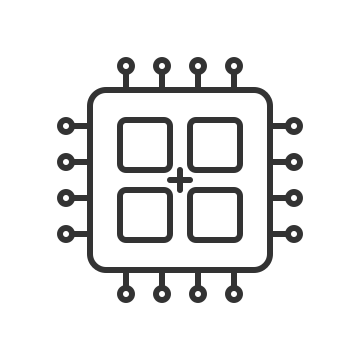
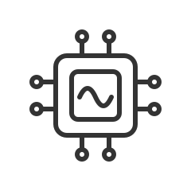

# Edge AI software and development tools

This site documents the software and development tools for building edge AI applications on TI's processors and microcontrollers, covering model development, optimization, and deployment across TI's edge AI hardware.

Content is organized by device class: Microprocessors (MPUs) running Linux with TIDL support, and Microcontrollers (MCUs) for Tiny ML. Each section covers the software stack, tools, and getting-started guides for that platform.

## Getting started
Two starting points, depending on what you need:

<table width="100%" style="display:table; width:100%; table-layout:fixed;">
<tr>
<td align="center" width="15%">

</td>
<td>

[ti.com/edgeai](https://www.ti.com/edgeai)

Overview of TI's Edge AI supported device portfolio and applications. Understand products, usecases, applications and tools offering.

</td>
</tr>
<tr>
<td align="center" width="15%">

</td>
<td>

[edgeai at github.com/TexasInstruments](https://github.com/TexasInstruments/edgeai)

Developer-focused entry point into TI's Edge AI software and tools. Software, examples and documentation for the edge AI developer.

</td>
</tr>
</table>

## Edge AI devices and software
Documentation is split by device class:

<table width="100%" style="display:table; width:100%; table-layout:fixed;">
<tr>
<td align="center" width="15%">

</td>
<td>

[Edge AI software for Microprocessors (MPUs)](edgeai-mpu/)

Edge AI software and development tools for Arm® Cortex®-A based Microprocessor devices (MPUs) with TI's C7™ NPU, with TIDL

</td>
</tr>
<tr>
<td align="center" width="15%">

</td>
<td>

[Edge AI software for Microcontrollers (MCUs)](edgeai-mcu/)

Edge AI software and development tools for Microcontroller (MCU) devices, connectivity devices and radar sensors.

</td>
</tr>
</table>

---

