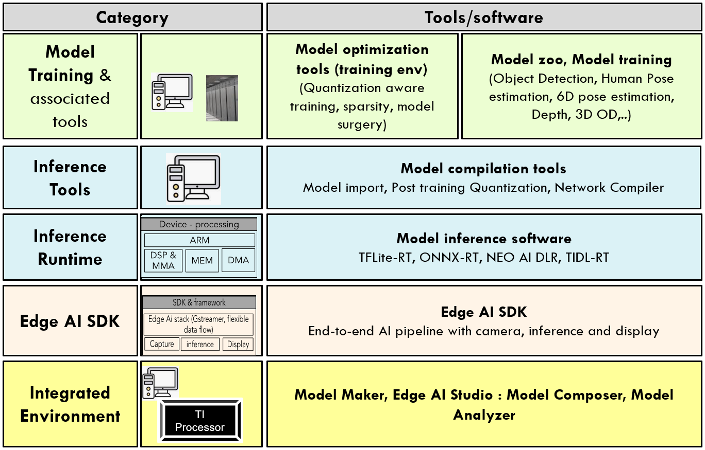
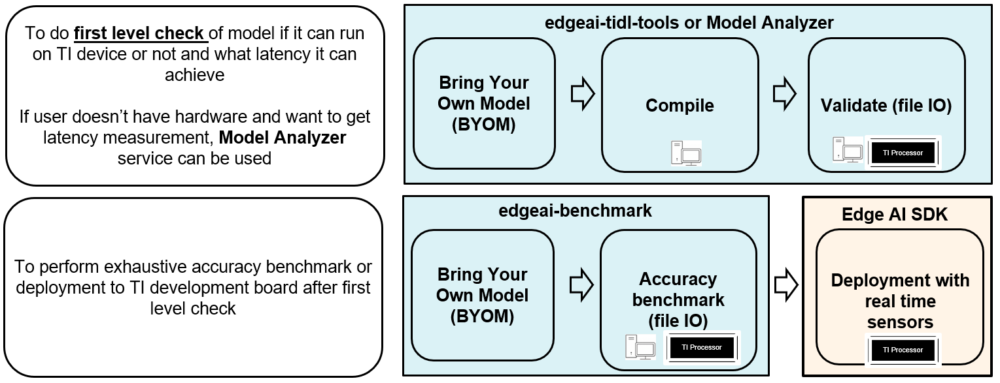
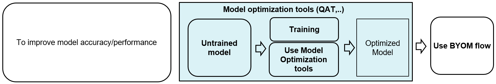
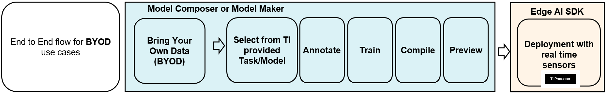

# Edge AI Software And Development Tools for Micro Processor devices with Linux and TIDL support

## Release Notes

- [2024 Dec ~ 2025 March] 10.1 release. SDKs, edgeai-tidl-tools and edgeai-tensorlab has been updated.

Further details are in the [Release Notes](./docs/release_notes.md). 

Also see the SDKs release notes, [edgeai-tidl-tools release notes](https://github.com/TexasInstruments/edgeai-tidl-tools/releases) and [edgeai-tensorlab release notes](https://github.com/TexasInstruments/edgeai-tensorlab/blob/main/docs/release_notes.md)

## Introduction

Embedded inference of Deep Learning models is quite challenging - due to high compute requirements. TI’s Edge AI comprehensive software product help to optimize and accelerate inference on TI’s embedded devices. It supports heterogeneous execution of DNNs across cortex-A based MPUs, TI’s latest generation C7x DSP and DNN accelerator (MMA). 

TI's Edge AI solution simplifies the whole product life cycle of DNN development and deployment by providing a rich set of tools and optimized libraries. 

## Overview

The figure below provides a high level summary of the relevant tools: 

## Details of various tools

The table below provides detailed explanation of each of the tools:

| Category                                                | Tool/Link| Purpose     | IS NOT                |
|---------------------------------------------------------|----------|-------------|-----------------------|
| **Inference (and compilation) Tools**                   |[edgeai-tidl-tools](https://github.com/TexasInstruments/edgeai-tidl-tools)| To get familiar with model compilation and inference flow - [Post training quantization](https://github.com/TexasInstruments/edgeai-tidl-tools/blob/master/docs/tidl_fsg_quantization.md) - Benchmark latency with out of box example models (10+) - Compile user / custom model for deployment - Inference of compiled models on X86_PC or TI SOC using file base input and output - Docker for easy development environment setup |- Does not support benchmarking accuracy of models using TIDL with standard datasets, for e.g. - accuracy benchmarking using MS COCO dataset for object detection models. Please refer to edgeai-benchmark for the same. - Does not support Camera, Display and inference based end-to-end pipeline development. Please refer Edge AI SDK for such usage    | |
| **Model Selection Tool**                                |[Edge AI Studio: Model Selection Tool](https://www.ti.com/tool/EDGE-AI-STUDIO) | Understand performance statistics of models such as FPS, Latency, Accuracy & DDR bandwidth. Find the model that best meets your performance and accuracy goals on TI Processor from TI Model Zoo.| |
| **Integrated environment for training and compilation** |[Edge AI Studio: Model Analyzer](https://www.ti.com/tool/EDGE-AI-STUDIO)| Browser based environment to allow model evaluation with TI EVM farm - Allow model evaluation without and software/hardware setup at user end - User can reserve EVM from TI EVM farm and perform model evaluation using jupyter notebook - **Model selection tool**: To provide suitable model architectures for TI devices                                                                                                             |- Does not support Camera, Display and inference based end-to-end pipeline development. Please refer Edge AI SDK for such usage   |                              |
|ditto                                                         |[Edge AI Studio: Model Composer](https://www.ti.com/tool/EDGE-AI-STUDIO)| GUI based Integrated environment for data set capture, annotation, training, compilation with connectivity to TI development board - Bring/Capture your own data, annotate, select a model, perform training and generate artifacts for deployment on SDK - Live preview for quick feedback                                                                                                                                                 |- Does not support Bring Your Own Model workflow  |
|**Edge AI Software Development Kit**| [Devices & SDKs](readme_sdk.md) | SDK to develop end-to-end AI pipeline with camera, inference and display - Different inference runtime: TFLiteRT, ONNXRT, NEO AI DLR, TIDL-RT - Framework: openVX, gstreamer - Device drivers: Camera, display, networking - OS: Linux, RTOS - May other software modules: codecs, OpenCV,…   |   |

| Category                                                | Tool/Link       | Purpose           | IS NOT    |
|---------------------------------------------------------|-----------------|-------------------|-----------|
| **Model Zoo, Model training, compilation/benchmark & associated tools** | [edgeai-tensorlab](https://github.com/TexasInstruments/edgeai-tensorlab)   | To provide model training software, collection of pretrained models and documemtation  and compilation/benchmark scripts. Includes edgeai-modelzoo, edgeai-benchmark, edgeai-modeloptimization, edgeai-modelmaker, edgeai-torchvision, edgeai-mmdetection and such repositories.      | |

## Workflows
Bring your own model (BYOM) workflow: 

Train your own model (TYOM) workflow: 

Bring your own data (BYOD) workflow: 

## Tech Reports

Technical documentation can be found in the documentation of each repository. Here we have a collection of technical reports & tutorials that give high level overview on various topics.

- [**Edge AI Tech Reports in edgeai-tensorlab**](https://github.com/TexasInstruments/edgeai-tensorlab/blob/main/docs/tech_reports/README.md)

## Publications

- Read some of our [**Technical publications**](./readme_publications.md)

## Issue Trackers
**Issue tracker for [Edge AI Studio](https://www.ti.com/tool/EDGE-AI-STUDIO)** is listed in its landing page.

**[Issue tracker for TIDL](https://e2e.ti.com/support/processors/f/791/tags/TIDL)**: Please include the tag **TIDL** (as you create a new issue, there is a space to enter tags, at the bottom of the page). 

**[Issue tracker for edge AI SDK](https://e2e.ti.com/support/processors/f/791/tags/EDGEAI)** Please include the tag **EDGEAI** (as you create a new issue, there is a space to enter tags, at the bottom of the page). 

**[Issue tracker for ModelZoo, Model Benchmark & Deep Neural Network Training Software](https://e2e.ti.com/support/processors/f/791/tags/MODELZOO):** Please include the tag **MODELZOO** (as you create a new issue, there is a space to enter tags, at the bottom of the page). 

## License
Please see the [LICENSE](./LICENSE) file for more information about the license under which this landing repository is made available. The LICENSE file of each repository is inside that repository.
