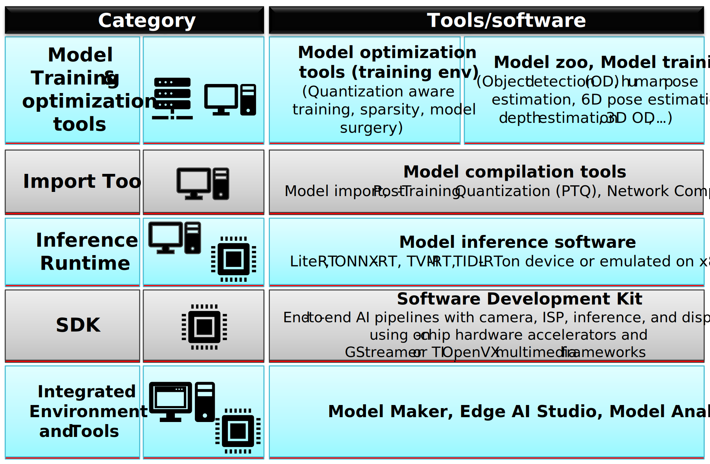
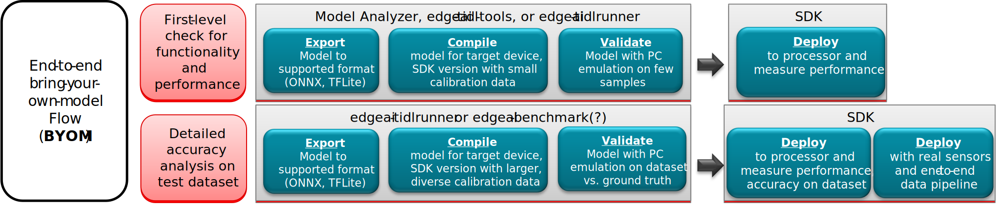
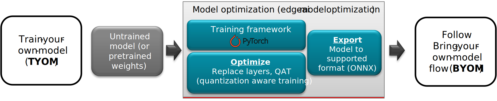
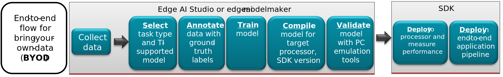

# Edge AI Software and Development Tools for Microprocessor devices with Linux and TIDL support

## Release Notes

For details, see [edgeai-tidl-tools release notes](https://github.com/TexasInstruments/edgeai-tidl-tools/releases) and [edgeai-tensorlab release notes](https://github.com/TexasInstruments/edgeai-tensorlab/blob/main/docs/release_notes.md) and the SDK release notes. Below is just a brief high level summary / timeline.

### [2026 March 24] 
- Updated documentation with details from 11.2 release. 
- Our recommended tool for model benchmark is now [edgeai-tidlrunner](https://github.com/TexasInstruments/edgeai-tidlrunner) instead of edgeai-benchmark

### [2026 March 10] 
- **edgeai-tidlrunner** release - simple commandline interface for BYOM - Model compilation, accuracy & performacne benchmark, analysis/debug - more features coming soon.
- **edgeai-tidl-tools** refactoring and simplification - with easier to use interface and scripts.

Additional information is [here](./release_notes.md)

## Introduction

Embedded inference of Deep Learning models is quite challenging - due to high compute requirements. TI’s Edge AI comprehensive software product help to optimize and accelerate inference on TI’s embedded devices. It supports heterogeneous execution of DNNs across Arm® Cortex®-A based MPUs, TI’s latest generation C7™ NPU. 

TI's edge AI solution simplifies the whole product life cycle of DNN development and deployment by providing a rich set of tools and optimized libraries. 

See our [Getting Started guide](./getting_started.md) for AM6xA and TDA4x with Edge AI and TI Deep Learning

## Overview

The figure below provides a high level summary of the relevant tools: 

## Details of various tools

### Model compilation & Model Zoo

| Category                                                | Tool/Link| Purpose     | IS NOT                |
|---------------------------------------------------------|----------|-------------|-----------------------|
| **Inference and compilation Tools** |[edgeai-tidl-tools](https://github.com/TexasInstruments/edgeai-tidl-tools)| Compile ONNX and TFLite models and run model inference in PC emulation and on target hardware with simple python scripts and C++ applications - Benchmark latency with out of box example models (10+) - Compile user / custom model for deployment - Inference of compiled models on X86_PC or TI SOC using file base input and output - Core [documentation](https://github.com/TexasInstruments/edgeai-tidl-tools/tree/master/docs) for TI Deep Learning - Automated optimizations for ONNX-format models - Docker for easy development environment setup |- Does not support benchmarking accuracy of models using TIDL with standard datasets, for example - accuracy benchmarking using MS COCO dataset for object detection models. Please refer to edgeai-tidlrunner or edgeai-benchmark. - Does not support Camera, Display and inference based end-to-end pipeline development. Please refer to the SDK    | 
| **Inference and compilation Tools** |[edgeai-tidlrunner](https://github.com/TexasInstruments/edgeai-tidlrunner)| Command-line tool for model compilation, inference, accuracy benchmark, model optimization, analysis, and visualized model inspection - No scripting required; set all model settings via command-line arguments or config file |- Does not support Camera, Display and inference based end-to-end pipeline development. Please refer Edge AI SDK for such usage - Supports TI SOC and x86 PC    | 
| **Model Zoo** |[Model Zoo](https://github.com/TexasInstruments/edgeai-modelzoo) | TI Model Zoo (example models) for MPU Edge AI. (also part of edgeai-tensorlab) | |
| **ONNX Model surgery** | [Documentation](https://github.com/TexasInstruments/edgeai-tidl-tools/tree/master/osrt-model-tools/osrt_model_tools/onnx_tools/tidl_onnx_model_optimizer), [Setup](https://github.com/TexasInstruments/edgeai-tidl-tools/tree/master/osrt-model-tools) | ONNX Model surgery to help TIDL Moidel compilation - convert operators that are unsupported in TIDL to supported operators (wherver possible) | | 

### Model training

| Category                                                | Tool/Link       | Purpose           | IS NOT    |
|---------------------------------------------------------|-----------------|-------------------|-----------|
| **Model training, compilation/benchmark & associated tools** | [edgeai-tensorlab](https://github.com/TexasInstruments/edgeai-tensorlab)   | Provide model training software, collection of pretrained models with documentation and compilation/benchmark scripts.  Includes edgeai-modelzoo, edgeai-benchmark, edgeai-modeloptimization, edgeai-modelmaker, edgeai-torchvision, and model-training repo forks like edgeai-mmdetection.      |  |
| **PyTorch Model Optimization** | [edgeai-modeloptimization](https://github.com/TexasInstruments/edgeai-modeloptimization)   | Tools and utilities to help the development of embedded friendly Neural Network Models in Pytorch.      |  |

 

### GUI & Integrated environment

| Category                                                | Tool/Link| Purpose     | IS NOT                |
|---------------------------------------------------------|----------|-------------|-----------------------|
| **Model Selection Tool** |[Model Selection Tool](https://dev.ti.com/gallery/view/edgeai/edgeai-modelselection) | Understand validated models' performance statistics such as FPS, latency, DDR bandwidth and accuracy (for standard datasets like imagenet1k). Find the model that best meets your performance and accuracy goals on TI Processor from TI Model Zoo.| |
| **Integrated environment for Model training and compilation** |[Edge AI Studio](https://www.ti.com/tool/EDGE-AI-STUDIO)| Part of the CCStudio™ development ecosystem. GUI based Integrated environment for data set capture, annotation, training, compilation with connectivity to TI development board - Bring/Capture your own data, annotate, select a model, perform training and generate artifacts for deployment on SDK - Live preview for quick feedback |- Does not support Bring Your Own Model workflow  |
| **Model Evaluation** |[Model Analyzer](https://www.ti.com/tool/EDGE-AI-STUDIO)| Browser based environment to allow model evaluation with TI EVM farm - Allow model evaluation without and software/hardware setup at user end - User can reserve EVM from TI EVM farm and perform model evaluation using jupyter notebook |- Does not support Camera, Display and inference based end-to-end pipeline development. Please refer Edge AI SDK for such usage - Does not give full access to the target processor; limited to on-target model inference and benchmarking results   | |

 

### SDK

| Category                                                | Tool/Link| Purpose     | IS NOT                |
|---------------------------------------------------------|----------|-------------|-----------------------|
| **Edge AI Software Development Kit**|[Devices & SDKs](readme_sdk.md) | SDK to develop end-to-end AI pipeline with camera, inference and display - Different inference runtime: TFLite/LiteRT, ONNXRT, TVM, TIDL-RT - Framework: openVX, gstreamer - Device drivers: Camera, display, networking - OS: Linux, RTOS - Many other software modules: codecs, OpenCV, OpenGL, …   | Does not support model compilation: this is supported only on an x86 machine  |

## Workflows
Bring your own model (BYOM) workflow: 

Train your own model (TYOM) workflow: 
* PyTorch is used within edgeai-modeloptimization. Other training frameworks may be used without our optimization and QAT tools, but models must export to ONNX or TFLITE format. 

Bring your own data (BYOD) workflow: 

## Tech Reports

Technical documentation can be found in the documentation of each repository. Here we have a collection of technical reports & tutorials that give high level overview on various topics.

- [**Edge AI Tech Reports in edgeai-tensorlab**](https://github.com/TexasInstruments/edgeai-tensorlab/blob/main/docs/tech_reports/README.md)

## Publications

- Read some of our [**Technical publications**](./readme_publications.md)

## Issue Trackers
**Issue tracker for [Edge AI Studio](https://www.ti.com/tool/EDGE-AI-STUDIO)** is listed in its landing page.

**[Issue tracker for TIDL](https://e2e.ti.com/support/processors/f/791/tags/TIDL)**: Please include the tag **TIDL** (as you create a new issue, there is a space to enter tags, at the bottom of the page). 

**[Issue tracker for edge AI SDK](https://e2e.ti.com/support/processors/f/791/tags/EDGEAI)** Please include the tag **EDGEAI** (as you create a new issue, there is a space to enter tags, at the bottom of the page). 

**[Issue tracker for ModelZoo, Model Benchmark & Deep Neural Network Training Software](https://e2e.ti.com/support/processors/f/791/tags/MODELZOO):** Please include the tag **MODELZOO** (as you create a new issue, there is a space to enter tags, at the bottom of the page). 

## License
Please see the [LICENSE](./LICENSE) file for more information about the license under which this landing repository is made available. The LICENSE file of each repository is inside that repository.
