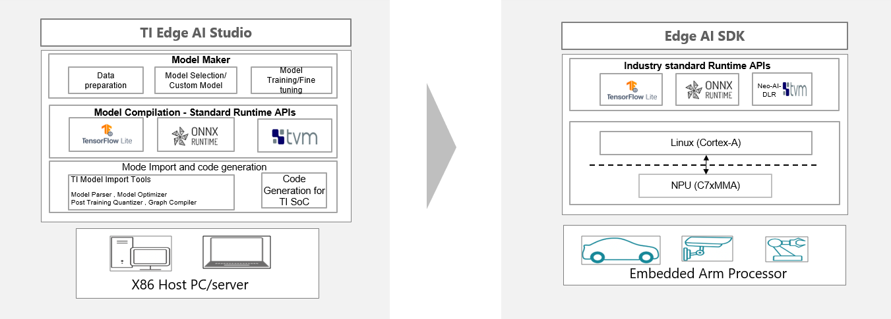

# Getting Started with Edge AI MPU's

This guide will focus on guiding you to the right resources, tools, examples, and documents for new users of TI's Edge AI solution for microprocessor (MPU) devices. This is a high-level, technical document intended for developers. 

**Quick links for developers:**
* [Skip straight to the details and start](#getting-started-with-your-selected-processor)
* [Understand the AI model development flow](#ti-edge-ai-model-development-flow)

Here we will focus on accelerated Edge AI devices from the AM6xA and TDA4x family of industrial and automotive processors. These feature the C7x-MMA neural network accelerator, which combines a SIMD-DSP and matrix multiplication accelerator for fast execution of neural nets. 
* Such devices are focused on computer vision and perception, featuring additional hardware acceleration for other vision functions like ISP, lens distortion correction, image scaling, stereo depth estimation[^1], and optical flow[^1].

Please find our demo applications and use-cases on [ti.com/edgeaiprojects](https://www.ti.com/edgeaiprojects) and from our [TexasInstruments-Sandbox Github repositories](https://github.com/TexasInstruments-Sandbox?q=edgeai&type=all&language=&sort=)

[^1]: Stereo depth and optical flow are part of the "DMPAC" accelerator, which is only on select processors

## Overview

To use these AM6xA and TDA4x processors for your Edge AI system, follow these steps:
1) [Select a processor and acquire evaluation hardware](#select-a-processor-suited-to-your-use-case)
2) Setup the [Software Development Kit (SDK) for your device](./readme_sdk.md), install to an SD card, and boot the Edge AI SDK on the evaluation/development hardware
3) [Use TI Deep Learning (TIDL) to compile neural network models for the C7xMMA AI accelerator and run on the target device](#ti-edge-ai-model-development-flow)
4) Run models with open-source runtimes and integrate into an end-to-end application with Gstreamer 

## Select a processor suited to your use-case 

TI has a scalable platform to cover a wide range of performance requirements. Our platform of AM6xA and TDA4x processors leverages common software so you may easily migrate to higher or lower performance devices.

Key considerations include:
1) Type of AI processing, how many models, and their complexity 
    * TOPS is the primary metric for Edge AI performance, but true benchmarks are needed because TOPS are not equivalent across the industry
    * **Note that TI Deep Learning (TIDL) software is optimized for vision-based models like CNN's and ViT's. Network architectures for language or time-series data may not be supported, e.g. LLM's and RNN's**
2) The number/type of sensors, e.g. cameras (and their resolution, framerate, etc.)
3) General purpose processing cores 
    *  Arm A-cores for high level operating system and general compute
    *  MCU/Real-time cores for IO, functional safety
4) IO and peripherals for external devices and networking, e.g. USB, PCIe, SPI, Ethernet 
5) Additional hardware acceleration needs, like GPU or stereo-depth accelerator\
6) Power budget and thermal dissipation

If you are not yet sure which processor to use, TI has resources to help decide without needing any development kits. The [following section](#low-touch-processor-evaluation-in-the-cloud) is geared to assist consideration #1 for AI processing capabilities.

If you have selected a processor already, skip ahead to a later section and [evaluate with local hardware](#getting-start-with-your-selected-processor)

#### Low-touch processor evaluation in the cloud
You can learn about and evaluate TI's Edge AI processor options before committing to a particular one. [TI's Edge AI Studio](https://dev.ti.com/edgeaistudio/) features tools for evaluating without local hardware, in TI's low/no-code environment.

Edge AI studio enables you to: 
1) View and compare benchmarks on common network architectures to understand processing speed, accuracy on standard datasets, DDR bandwidth, and more with _Model Selection Tool_
2) Compile models in the cloud and and run models on a cloud-host EVM with _Model Analyzer_
3) Curate a dataset, fine-tune a model, and compile for a target processor with _Model Composer_

Please view the _Model Selection_ tool to understand achievable performance across the TI's Edge Ai processors and select the one most suited to your needs. If you'd like to see more of the programming interface and run a few benchmarks yourself, check out the _Model Analyzer_!

## Getting started with your selected processor
Please note that some SDK documentation links will take you to the AM62A docs -- equivalent pages will exist in the docs pages for other SOCs as well.

Follow these guidelines for Edge AI development: 

1) Acquire a development/evaluation board, often called a Starter Kit EVM.
2) Setup the [Software Development Kit (SDK)](./readme_sdk.md) on an SD card for the development board.
3) Evaluate the [out-of-box demo and sample end-to-end pipelines](https://software-dl.ti.com/processor-sdk-linux/esd/AM62AX/latest/exports/edgeai-docs/common/sample_apps.html) on models from [TI's model zoo](./README.md#details-of-various-tools). 
4) Bring your AI task onto the processor by compiling and running models for your target hardware.
    * Compile models yourself with [edgeai-tidl-tools](https://github.com/TexasInstruments/edgeai-tidl-tools) -- Recommended to first try with [pre-validated examples](https://github.com/TexasInstruments/edgeai-tidl-tools?tab=readme-ov-file#validate-and-benchmark-out-of-box-examples), especially Python3 examples.
    * Bring your own model (BYOM) and compile for the processor with [edgeai-tidl-tools custom model flow](./https://github.com/TexasInstruments/edgeai-tidl-tools/blob/master/docs/custom_model_evaluation.md#custom-model-evaluation), using Python. 
        * Please note: The more unique/custom your model is, the more likely you will need to modify the code to handle preprocessing and postprocessing.
5) Test and optimize your model for performance and accuracy
    * Embedded AI accelerators typically use fixed-point math rather than floating point to speed up processing time. Some accuracy loss is expected -- TI has tooling to mitigate this. 
    * Ensure your as many of your model's layers are supported as possible -- [see the list of supported operators](https://github.com/TexasInstruments/edgeai-tidl-tools/blob/master/docs/supported_ops_rts_versions.md).
    * Optimize accuracy with more calibration data, QAT, and hybrid quantization modes -- learn more in the [edgeai-tidl-tools docs](https://github.com/TexasInstruments/edgeai-tidl-tools/tree/master/docs) and [available compilation settings](https://github.com/TexasInstruments/edgeai-tidl-tools/tree/master/examples/osrt_python#user-options-for-tidl-acceleration).
6) Integrate into application with Gstreamer or TI OpenVX
   * Start from [example dataflows](https://software-dl.ti.com/processor-sdk-linux/esd/AM62AX/latest/exports/edgeai-docs/common/edgeai_dataflows.html) to run your model in an end-to-end pipeline.
   * Linux systems should use [Gstreamer](https://github.com/TexasInstruments/edgeai-gst-apps); non-Linux systems and/or tightly optimized applications (including ADAS) may leverage [TIOVX](https://github.com/TexasInstruments/edgeai-tiovx-apps).

See the next section on AI model development to learn more steps #4 and #5.

## TI Edge AI model development flow

At a high-level, the Edge AI development flows features two stages. 
1) On x86 host machine (PC or server), import and compile a trained model for the C7xMMA AI accelerator
    * Compiled models can be run on PC with a bit-accurate emulator of the C7xMMA to evaluate and optimize accuracy 
2) Transfer your compiled model to the embedded processor and accelerate with standard runtimes.

TI provides tools for various points in the process. See more in the [parent page](./README.md), which lists and provides detail on each of these tools. 
* For each GUI-based tool, there is a corresponding open source, programmatic / command-line tool

After initial evaluation of a model architecture, developers will often iterate on their model to achieve optimal performance and accuracy. 
* The first stage of performance optimization is by ensuring all layers within a model have acceleration support. See our list of [supported operators](https://github.com/TexasInstruments/edgeai-tidl-tools/blob/master/docs/supported_ops_rts_versions.md)
* Accuracy optimization can be approached during or after model training. Please find supporting materials in our github repositories for topics on [post training quantization (PTQ)](https://github.com/TexasInstruments/edgeai-tidl-tools/blob/master/docs/tidl_fsg_quantization.md) and [quantization-aware training (QAT)](https://github.com/TexasInstruments/edgeai-tensorlab/tree/main/edgeai-modeloptimization/torchmodelopt/edgeai_torchmodelopt/xmodelopt/quantization)