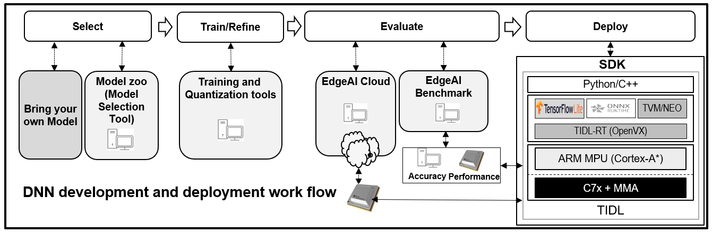

# EdgeAI Software And Development Tools
Real Time Inference Software & Model Development For Embedded AI Development.

## Introduction
This repository provides several **tools for AI**, including Deep Learning, traditional Machine Learning and Computer Vision. 

Embedded Inference of Deep Learning models is quite challenging - due to high compute requirements. The tools provided here help to optimize and accelerate inference on embedded devices.

## Software Development Kits (SDKs)

**[Software Development Kits (SDKs) and associated tools](readme_sdk.md)**

## Deep Neural Network Model Making Tools

**[Model Zoo, Model Selection, Model Training, Quantization & Benchmarking Tools](readme_models.md)**

## Issue Trackers
**[Issue Tracker for TIDL, SDK etc](https://e2e.ti.com/support/processors/f/791/tags/TIDL)**: Please include the tag **TIDL** (as you create a new issue, there is a space to enter tags, at the bottom of the page). 

**[Issue Tracker for ModelZoo, Model Benchmark & Deep Neural Network Training Software](https://e2e.ti.com/support/processors/f/791/tags/jacinto_2D00_ai_2D00_devkit):** You can file issues or ask questions at **e2e**. While creating a new issue kindly include **modelzoo** in the tags (as you create a new issue, there is a space to enter tags, at the bottom of the page). 

## What is New
[2021-August] Several of our repositories are being moved from git.ti.com to github.com

## License
Please see the [LICENSE](./LICENSE) file for more information about the license under which this landing repository is made available. The LICENSE file of each repository mentioned here is inside that repository.
