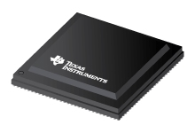
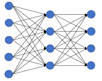

# EdgeAI Software And Development Tools
Models Training, Quantization, Model Zoo, Benchmarking For Embedded AI Development.

## Introduction
Embedded Inference of Deep Learning models is quite challenging - due to high compute requirements. This page aims to showcase various **tools for AI**, including Deep Learning, traditional Machine Learning and Computer Vision. We show several **low complexity** Deep Learning models that make  Inference on Low Power Embedded Platforms practical. We also have examples for **Quantization Aware Training** for 8-bit fixed point inference.

This github repository does not contain any code, but has links that point to the actual repositories containing code. 

## Model Zoo & Benchmark
Example Deep Neural Network Models for our embedded devices - e.g. [TDA4VM](http://www.ti.com/product/TDA4VM)  

 

- **[edgeai-modelzoo](https://github.com/TexasInstruments/edgeai-modelzoo)**: Large collection of pre-trained example models for our platform. We also information on how to train some of the important models, and also the complexity and what accuracy to expect.  

- **[edgeai-benchmark](https://github.com/TexasInstruments/edgeai-benchmark)**: Accuracy benchmarking of Deep Learning models is a difficult task. We make it easy for our platform with a Python package that runs on PC as well as on our EVM. The pre-trained models in our Model Zoo are supported off-the-shelf in this benchmark code. Accuracy benchmark of custom models can also be done easily with just a few lines of code. This repository also contains information about Pre-Imported model artifacts that can be used for testing inference on our device. 

## Model Training Tools And Repositories
Deep Neural Network Model Training for our embedded devices.

 

- **[edgeai-torchvision](https://github.com/TexasInstruments/edgeai-torchvision)**: Enhancement of [pytorch/vision a.k.a. torchvision](https://github.com/pytorch/vision). Support is added for training [embedded friendly Lite versions](https://github.com/TexasInstruments/edgeai-torchvision/tree/master/references) of torchvision's Classification, Segmentation & Detection reference models. We also have [our own embedded friendly Lite models](https://github.com/TexasInstruments/edgeai-torchvision/tree/master/references/pixel2pixel) for Image Classification, Semantic Segmentation, Depth Estimation, Motion Segmentation and various other Pixel2Pixel tasks including Multi-Task Learning.  

- **[edgeai-mmdetection](https://github.com/TexasInstruments/edgeai-mmdetection)**: PyTorch based **Object Detection** training/quantization of embedded friendly Lite models. Uses the popular [mmdetection](https://github.com/open-mmlab/mmdetection) repository. 

- **[edgeai-yolov5](https://github.com/TexasInstruments/edgeai-yolov5)**: PyTorch based **Object Detection** training of YOLOv5 models. This is a fork of the popular [ultralytics/yolov5](https://github.com/ultralytics/yolov5) repository - we have tweaked it to make the resulting models embedded friendly. 

## Model Quantization
Quantization (especially 8-bit Quantization) is important to get best throughput for inference. Quantization can be done using either **Post Training Quantization (PTQ)** or **Quantization Aware Training (QAT)**.

TIDL natively supports PTQ - it can take floating point models and can quantize them using advanced calibration methods. 

We have  guidelines on how to choose models and how train them to get best accuracy with Quantization. It is unlikely that there will be significant accuracy drop with **PTQ** if these guidelines are followed. In spite of this, if there are models that have significant accuracy drop with quantization, it is possible to improve the accuracy using **QAT**. Please read more details in the [edgeai-torchvision](https://github.com/TexasInstruments/edgeai-torchvision) and its documentation on **[Quantization](https://github.com/TexasInstruments/edgeai-torchvision/blob/master/docs/pixel2pixel/Quantization.md)**.

## What is New:
- [2021-July] Several of our repositories are being moved from git.ti.com to github.com

## Notes: 
- Information about Deep Neural Network Model training software for our older family of devices is [here](./readme_modelzoo-j6.md).

