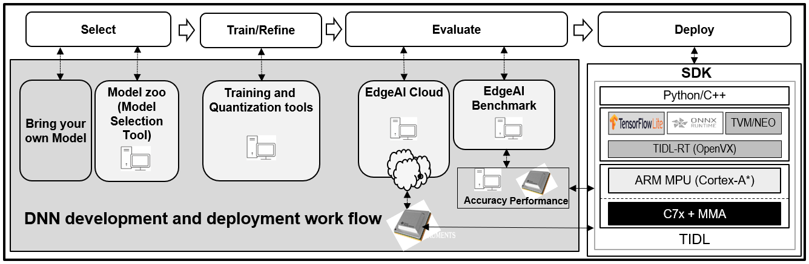

# EdgeAI DNN Model Development Tools

Models Zoo, Model Selection, Training, Quantization & Benchmarking

## Introduction
We showcase several **low complexity** Deep Learning models that make  Inference on Low Power Embedded Platforms practical. 

Model training repositories are provided to help to train embedded friendly models. 

We also have Python modules and examples for **Quantization Aware Training** to generate quantized models for 8-bit fixed point inference.

## EdgeAI Cloud Evaluation
**[EdgeAI Cloud Evaluation](https://www.ti.com/tool/TI-EDGE-AI-CLOUD)** is a free online service that lets you evaluate accelerated deep learning inference on TI devices from your browser in minutes. Also provided there, is TI's Model Selection Tool that enables picking the ideal model for TI's embedded devices.

## Model Zoo & Benchmark
Example Deep Neural Network Models for our embedded devices - e.g. [TDA4VM](http://www.ti.com/product/TDA4VM)

**[edgeai-benchmark](https://github.com/TexasInstruments/edgeai-benchmark)**: A python based framework which allows you to perform model compilation, accuracy and performance benchmark. Accuracy benchmark can be performed without development board, but for performance benchmark, a development board is needed. The pre-trained models in our Model Zoo are supported off-the-shelf in this benchmark code and pre-compiled model artifacts provided along with the model zoo can be used. This repository uses [edgeai-tidl-tools](https://github.com/TexasInstruments/edgeai-tidl-tools) for model compilation and inference.

**[edgeai-modelzoo](https://github.com/TexasInstruments/edgeai-modelzoo)**: Large collection of pre-trained example models for our platform. Also provides information on how to train models using popular repositories. Pre-compiled model artifacts (created using edgeai-benchmark) are also provided.

## Model Training Tools
Training tools based on popular Deep Learning Frameworks, allowing data scientists to make DNNs more suitable for TI devices.

**[edgeai-torchvision](https://github.com/TexasInstruments/edgeai-torchvision)**: Enhancement of [pytorch/vision a.k.a. torchvision](https://github.com/pytorch/vision). Support is added for training [embedded friendly Lite versions](https://github.com/TexasInstruments/edgeai-torchvision/tree/master/references) of torchvision's Classification, Segmentation & Detection reference models. We also have **[our own embedded friendly Lite models](https://github.com/TexasInstruments/edgeai-torchvision/tree/master/references/pixel2pixel)** for Image Classification, Semantic Segmentation, Depth Estimation, Motion Segmentation and various other Pixel2Pixel tasks including Multi-Task Learning.

**[edgeai-mmdetection](https://github.com/TexasInstruments/edgeai-mmdetection)**: PyTorch based **Object Detection** training of embedded friendly Lite models. Uses the popular [mmdetection](https://github.com/open-mmlab/mmdetection) repository.

**[edgeai-yolov5](https://github.com/TexasInstruments/edgeai-yolov5)**: PyTorch based **Object Detection** training of YOLOv5 models. This is a fork of the popular [ultralytics/yolov5](https://github.com/ultralytics/yolov5) repository - we have tweaked it to make the resulting models embedded friendly.

## Model Quantization
Tools for **Quantization Aware Training (QAT)** in PyTorch are given in [edgeai-torchvision](https://github.com/TexasInstruments/edgeai-torchvision) and its documentation on **[Quantization](https://github.com/TexasInstruments/edgeai-torchvision/blob/master/docs/pixel2pixel/Quantization.md)**.

- Quantization (especially 8-bit Quantization) is important to get best throughput for inference. Quantization can be done using either **Post Training Quantization (PTQ)** or **Quantization Aware Training (QAT)**.

- TIDL natively supports PTQ - it can take floating point models and can quantize them using advanced calibration methods. In the above page, we have provided guidelines on how to choose models and how train them for best accuracy with Quantization - these guidelines can reduce accuracy drop during deployment with **PTQ**. 

- In spite of following these guidelines, if there are models that have significant accuracy drop with PTQ, it is possible to improve the accuracy using **QAT**.

## Notes: 
Information about Deep Neural Network Model training software for our older family of devices is [here](./readme_models-j6.md).

