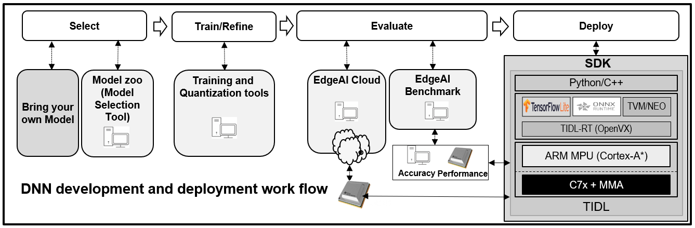

## EdgeAI Software Development Kit

**[EdgeAI-SDK](http://software-dl.ti.com/jacinto7/esd/edgeai-sdk-j721e/latest/exports/docs/)** - With a few simple steps you can run high performance Computer Vision and Deep Learning demos using live camera and display on TI’s latest Jacinto7/TDA4VM heterogeneous SoC.

**[PROCESSOR-SDK](https://www.ti.com/tool/PROCESSOR-SDK-J721E)** which consists of RTOS, Linux & QNX SDKs. Processor-SDK-RTOS (PSDK-RTOS) and Processor-SDK-Linux (PSDK-LINUX) together form a multi-processor software development kit for the J721E platform. The SDK provides a comprehensive set of software tools and components to help users develop and deploy their applications on supported SoCs. EdgeAI Development Kit is built using this.

**[TI Deep Learning Library/Product (TIDL)](https://software-dl.ti.com/jacinto7/esd/processor-sdk-rtos-jacinto7/latest/exports/docs/psdk_rtos/docs/user_guide/sdk_components_j721e.html#ti-deep-learning-library-tidl)** - The package that contains TI Deep Learning inference engine, deep learning network compiler (DLNAPS) and deep learning network import tool for C7x/MMA.

## Tools & Repositories

**[edgeai-gst-plugins](https://github.com/TexasInstruments/edgeai-gst-plugins)**: Repository to host GStreamer plugins for TI's EdgeAI class of devices

**[tensorflow](https://github.com/TexasInstruments/tensorflow)**: TensorFlow is an end-to-end open source platform for machine learning. It has a comprehensive, flexible ecosystem of tools, libraries, and community resources that lets researchers push the state-of-the-art in ML and developers easily build and deploy ML-powered applications. Please see the branch **tidl-j7** for changes specific to our device.

**[onnxruntime](https://github.com/TexasInstruments/onnxruntime)**: ONNX Runtime is a cross-platform inference and training machine-learning accelerator. Please see the branch **tidl-j7** for changes specific to our device.

**[neo-ai-dlr](https://github.com/TexasInstruments/neo-ai-dlr)**: DLR is a compact, common runtime for deep learning models and decision tree models compiled by AWS SageMaker Neo, TVM, or Treelite. Please see the branch **tidl-j7** for changes specific to our device.

**[tvm](https://github.com/TexasInstruments/tvm)**: Apache TVM (incubating) is a compiler stack for deep learning systems. It is designed to close the gap between the productivity-focused deep learning frameworks, and the performance- and efficiency-focused hardware backends. TVM works with deep learning frameworks to provide end to end compilation to different backends.  Please see the branch **tidl-j7** for changes specific to our device.
