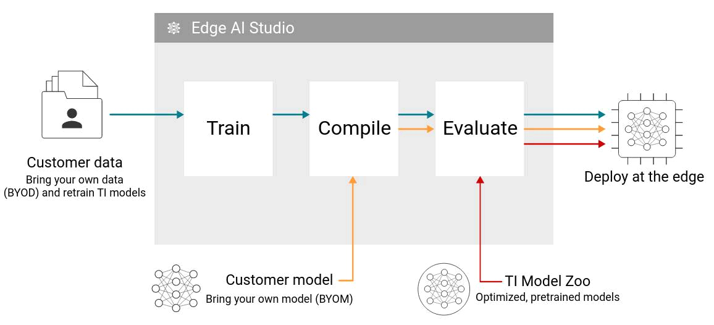

**[EDGE-AI-STUDIO](https://www.ti.com/tool/EDGE-AI-STUDIO)** Edge AI Studio is a collection of tools aimed to accelerate the development of edge AI application on TI embedded devices.
- Model Analyzer, formerly known as TI edge AI cloud, is a free online service that allows for the evaluation of accelerated deep learning inference on remotely accessed development boards. With Model analyzer it only takes minutes to login, deploy a model and obtain a variety of performance benchmarks.
- Model Composer is a fully integrated solution for creating edge AI applications. Collect, annotate data, train models, and compile models for deployment on edge devices. It supports Bring-Your-Own-Data (BYOD), enabling the re-training of models from the TI Model Zoo with custom data. This allows for more performance optimization.

